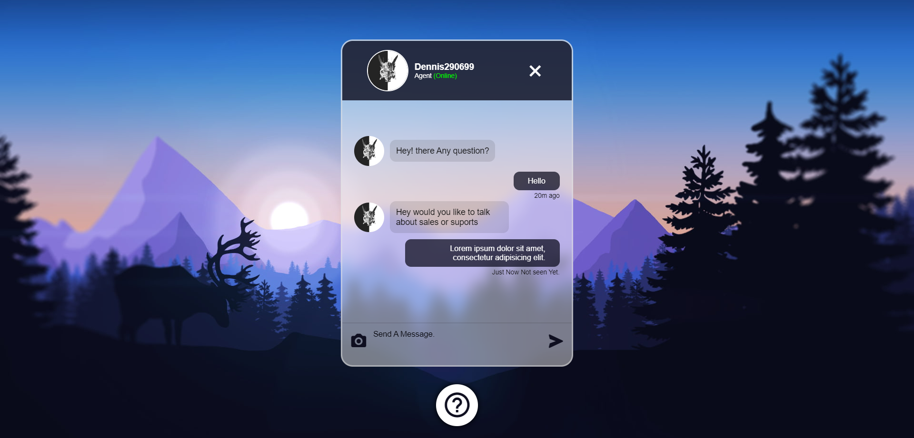

# ChatBot

Este proyecto es una página web de chatbot simple que permite a los usuarios interactuar con un agente virtual. Los usuarios pueden enviar mensajes y recibir respuestas del agente. La aplicación utiliza tecnologías web estándar como HTML, CSS y JavaScript.

## Demostración

Puedes probar una demostración en vivo de este proyecto en el siguiente enlace:

[Demo del ChatBot](#)

## Captura de Pantalla



## Características

- Interfaz de chat atractiva y fácil de usar.
- Conversación simulada entre un agente virtual y el usuario.
- Iconos de ayuda y funcionalidad de cierre de chat.
- Personalización con imágenes de perfil.
- Diseño responsivo para adaptarse a diferentes tamaños de dispositivos.

## Uso

1. Clona este repositorio en tu máquina local:

   ```
   git clone https://github.com/Dennis290699/ChatBot.git
   ```

2. Abre el archivo `index.html` en tu navegador web.

3. Interactúa con el chatbot enviando mensajes en la caja de texto.

## Tecnologías Utilizadas

- HTML
- CSS
- JavaScript

## Contribuciones

Si deseas contribuir a este proyecto, ¡te damos la bienvenida! Puedes abrir problemas (issues) o enviar solicitudes de extracción (pull requests) para sugerir mejoras o corregir errores.

## Licencia

Este proyecto está bajo la Licencia MIT. Consulta el archivo [LICENSE](./LICENSE) para obtener más detalles.

¡Gracias por visitar nuestro ChatBot!

